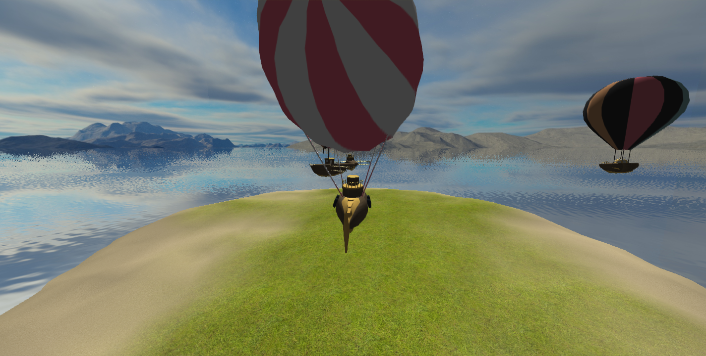
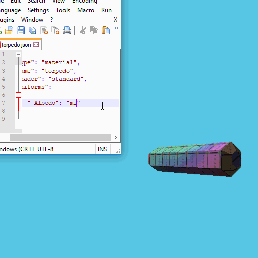
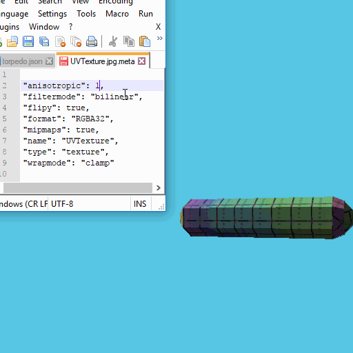

# Floaty Boaty Go Go

A small game written in C++ using OpenGL for rendering.



## About

Floaty Boaty Go Go is a result of a 3-week project that was an assignment for
programmers participatig in the [DADIU](http://www.dadiu.dk/) programme.
Durig this game development course, all game progammers were asked to author
a a game without use of a game engine. In my case I chose to built what became
_Floaty Boaty Go Go_. The project was developed beyond the 3 weeks alloted
for the project.

In the game, the player controls an airship and must fight other airships
controlled by a simple AI. The game is mostly used to explore how
to write a code base that facilitates a somewhat good asset pipeline
and how to make a flexible system that can be used to build possibly not just
one single game or game type.

## Architecture

At the core of the game an [ECS](ECS) patteren is applied. With this design.
With such a pattern, each entity is by itself only an id without any behavior
or functionality. Different logic and presence of the entites are added
via components. This way, entities can change what they are and what they
are capable of at runtime.

The [ECS](ECS) pattern is implemented to give each component an esay interface
to access other components. An example of this is the `AIControls` interacting
with the `ShipMovement`. The `ShipMovement` is the component that moves
each ship determining speed, height etc. The `AIControls` components
implements an AI hardly worthy of it's title, that simply moves forwards
until reacging the center of the map where is stops. The update loop for the
`AIControls` is as follows:

```
void AIControls::Update()
{
    Transform *transform = GetComponent<Transform>();

    glm::vec3 position = transform->GetLocalPosition();

    position.y = 0.0f;

    // stop the ship when reaching the center
    if (glm::length(position) < 1.0f)
    {
        ShipMovement *shipMovement = GetComponent<ShipMovement>();

        shipMovement->SetThrottle(0.0f);
    }
}
```

This demonstrates how the components can get pointers to other components
on the same entity, and interact with them.

## Assets

All game specific assets (icluding) code is located in the _assets_ folder.
Before runtime, a python script (`AssetDatabaseBuilder.py`) walks through
the _assets_ folder and compiles a _JSON_ file that maps all asset types
to paths for some assets, creates a _meta_ file that contains information
on how assets should be loaded at runtime.

Some assets must be manually written in _JSON_ format. As an example,
`material` assets must be written in _JSON_ format manually, an exmaple
is as follows:

```
{
    "type": "material",
    "name": "island",
    "shader": "island",
    "uniforms":
    {
        "_Sand": "sand",
        "_Grass": "grass"
    }
}
```

Here, one identifies the type and name, which must be present for the asset database
script to pick it up. then, a shader is specified along with a list of uniforms
the material should set on the given shsader.

The assetdatabase can in a certain build configuration monitor changes in the
_asset_ folder, and keep track of which assets depends on which files.
If asset tracking is enabled, assets may be changed at runtime. This has so far
provem to be useful for sahders and textures.

An exmaple of a material changing texture to a missing texture and back to the
original can be seen below.

<p align="center">

</p>

Another example is changing the settings of the texture loading. One can choose
some simple things like whether to use mipmaps or not, what kind of sampling filter
to use, repeat modes etc.

<p align="center">

</p>

[ECS]: https://en.wikipedia.org/wiki/Entity%E2%80%93component%E2%80%93system
